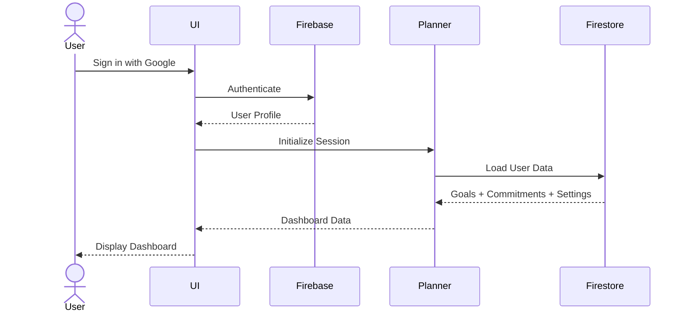
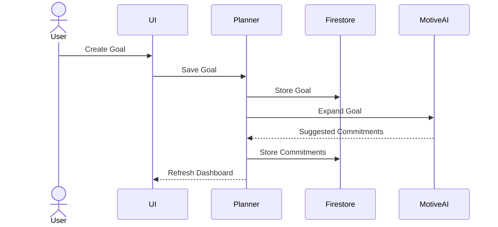
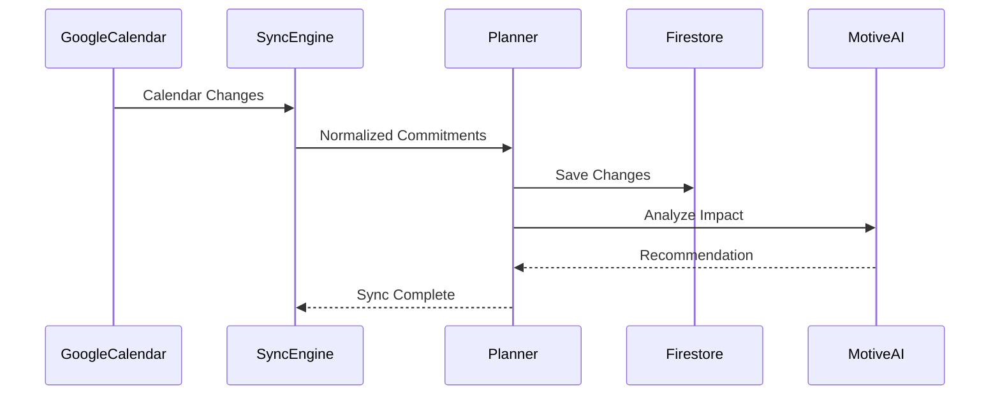
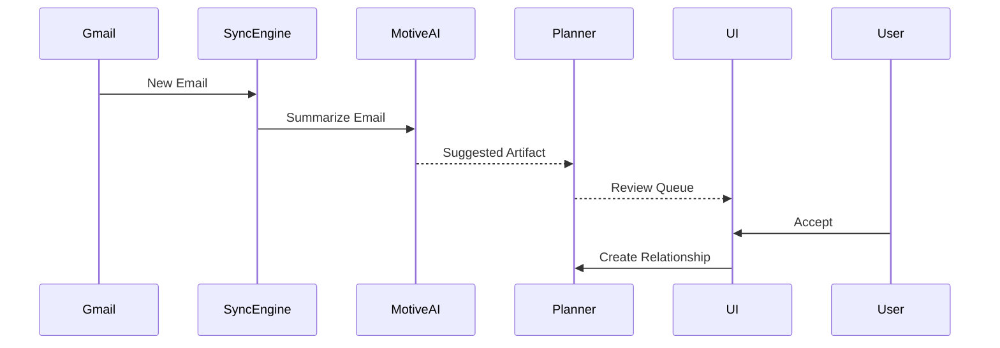
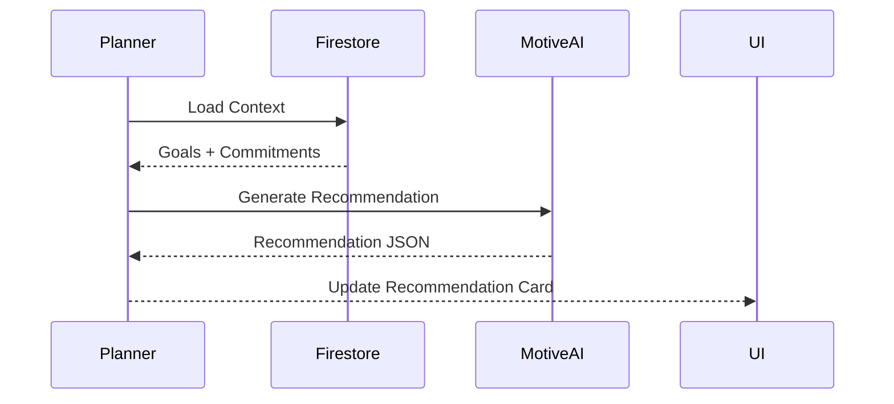
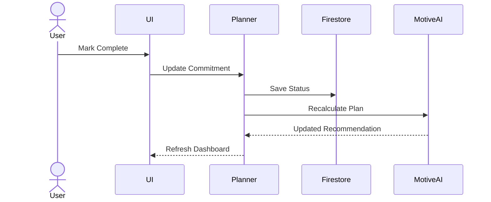
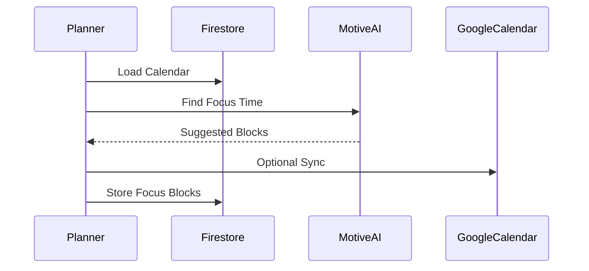
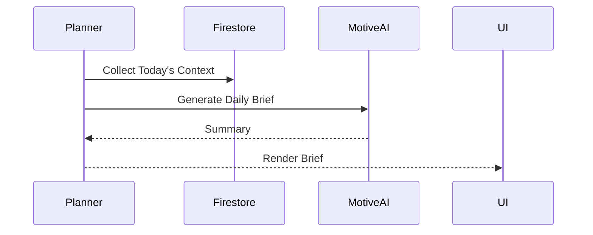
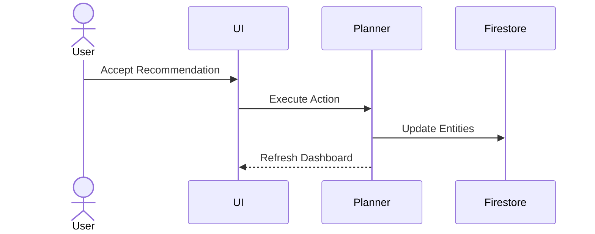
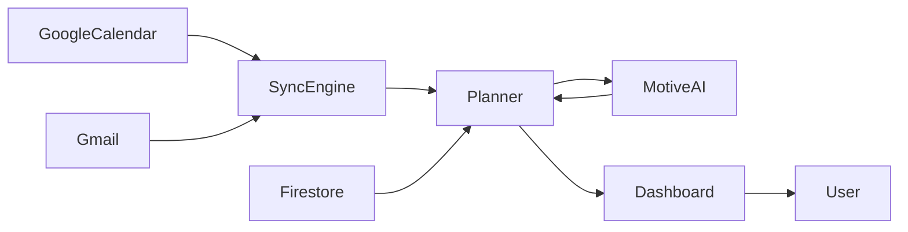

# Motive — Sequence Diagrams

**Version:** 1.0

---

# Purpose

This document describes the major user journeys and system interactions within Motive.

These diagrams focus on how information flows through the application rather than implementation details.

The architecture follows:

- User Initiates
- Planner Orchestrates
- Motive AI Reasons
- Google Services Provide Context
- UI Displays Results

---

# Flow 1 — User Login

---

# Flow 2 — Create Goal

---

# Flow 3 — Calendar Synchronization

---

# Flow 4 — Gmail Discovery

---

# Flow 5 — Recommendation Generation

---

# Flow 6 — Complete Commitment

---

# Flow 7 — Focus Block Planning

---

# Flow 8 — Daily Brief

---

# Flow 9 — Recommendation Acceptance

---

# Flow 10 — End-to-End Overview

---

# Design Principles

Every flow follows the same philosophy.

- Planner owns orchestration.
- Motive AI performs reasoning.
- Firestore stores data.
- Google remains the source of truth.
- UI never communicates directly with external services.

---

# Guiding Principle

Every user interaction should follow:

Input

↓

Planner

↓

Reasoning

↓

Persistence

↓

UI Update

This keeps the architecture predictable, testable, and scalable.